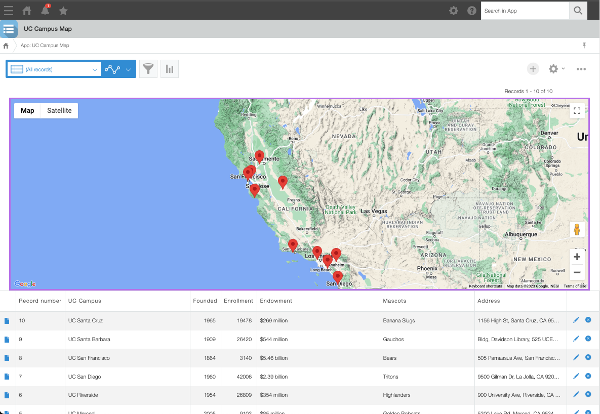
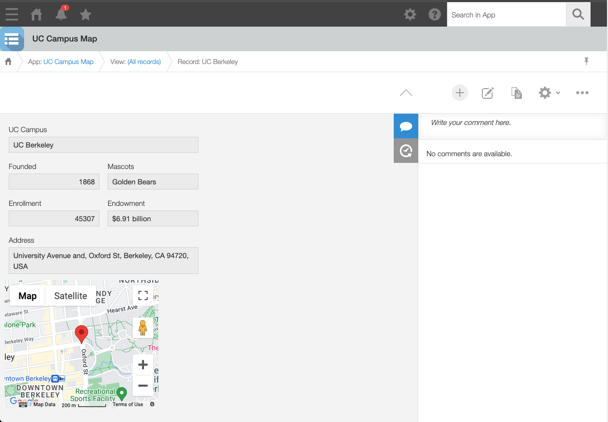
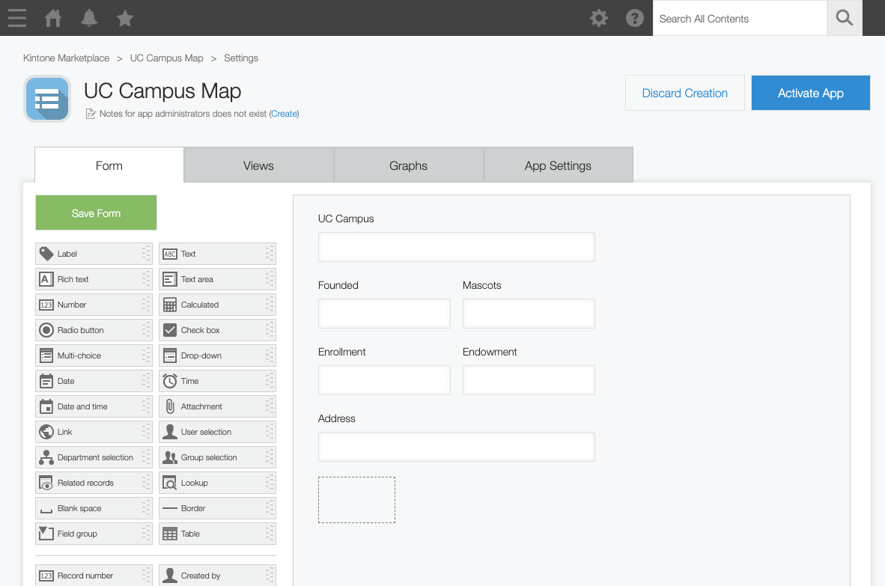
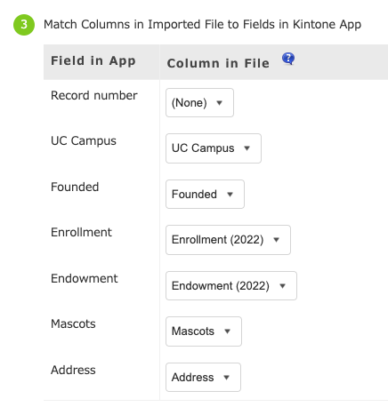
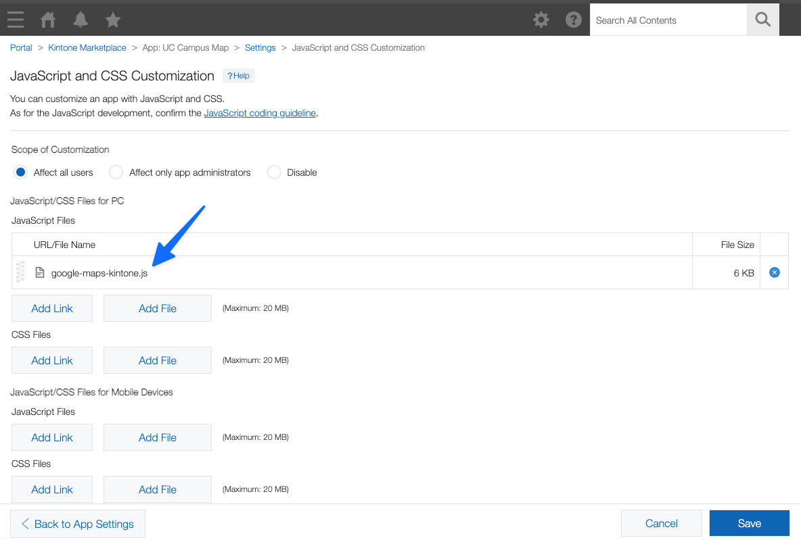

# Display Kintone Records on Google Maps

## TL;DR
* Sample code that displays locations on Google Maps from a Kintone App
* Each record has an address field
* The address field is geocoded to a latitude and longitude using Google Maps API
* The latitude and longitude is displayed on Google Maps
* Everything is stored in my GitHub repo: [emilythecat/googlemaps-kintone](https://github.com/emilythecat/googlemaps-kintone)

## Demo

| List View                               | Record View                                 |
| --------------------------------------- | ------------------------------------------- |
|  |  |

## Introduction
Here is a blog post and sample code to display Kintone records on Google Maps. It is a submission for the Kintone Customization Contest 2023.

As an example, I have created a "UC Campus" app that lists the University of California campuses. Each record has an address field.

## Prerequisites
* Kintone Developer License - [Form](https://kintone.dev/en/developer-license-registration-form/)
* Google Maps API Key - [Video tutorial](https://youtu.be/2_HZObVbe-g)

## Steps
1. Create a Kintone App with the following fields:

    | Field Name | Field Code   | Field Type |
    | ---------- | ------------ | ---------- |
    | UC Campus  | `name`       | Text       |
    | Founded    | `founded`    | Number     |
    | Enrollment | `enrollment` | Number     |
    | Endowment  | `endowment`  | Text       |
    | Mascots    | `mascots`    | Text       |
    | Address    | `address`    | Text       |
    | -          | `map`        | Space      |

1. Import the data from the `uc-campus.csv` file (provided below)
1. Copy the `google-maps-kintone.js` file to your local machine (provided below)
1. Insert your Google Maps API Key into the `google-maps-kintone.js` file:
    * `const API_KEY = 'Insert_your_API_key_here';`
1. Upload the `google-maps-kintone.js` file to the Kintone App's JavaScript and CSS Customization settings
1. All done! Refresh the page to universities the Google Maps

### Screenshots of the Steps

| Step 1                                        | Step 2                                            | Step 3                                    |
| --------------------------------------------- | ------------------------------------------------- | ----------------------------------------- |
|  |  |  |

## Debugging
* API key is invalid - verify that the API key is correct, has Google Maps API enabled, and Kintone's domain is whitelisted
* Verify that the `address` field is filled out for each record
* Verify that the Kintone's field codes are matching in the values in the `google-maps-kintone.js` file

## Files
* [uc-campus.csv](./uc-campus.csv) - sample data
* [google-maps-kintone.js](./google-maps-kintone.js) - sample code
